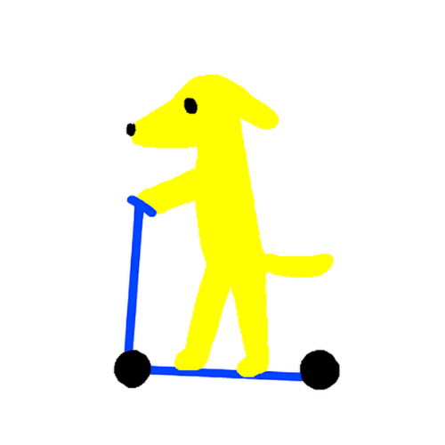
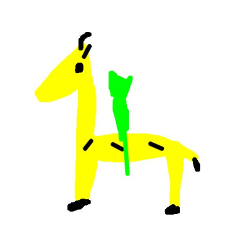
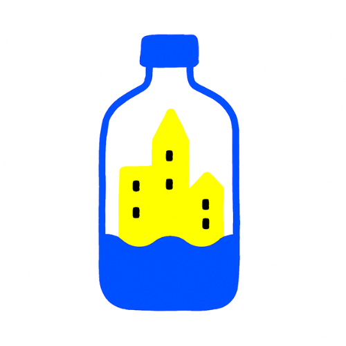
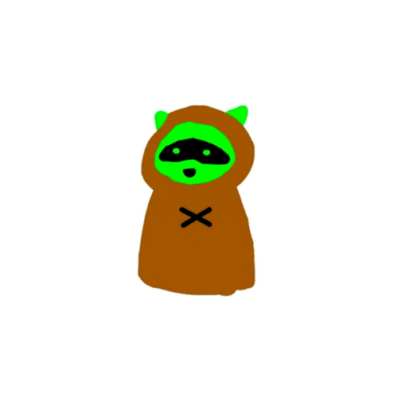

# Promraw

Promraw is a decentralized, AI-powered creative platform where users submit daily sketches based on quirky, AI-generated prompts. Submissions are scored by our custom AI (“Paint,” a VLM trained on image-text pairs via CLIP/Gemini), and top artworks can be “coined” on Zora’s Platform. A leaderboard ranks artists by AI score, unlocking rewards and extra platform features.

---

## 🚀 How It Works

- **Silly Prompts**: Every day you get a quirky drawing challenge—e.g. “a shark in a barrel” or “the world’s fastest frog.”
- **Drawing**: Sketch your take right in the browser using our built-in canvas tool.
- **AI Scoring**: Upon submission, Paint evaluates how well your drawing matches the prompt’s visual concept (via Gemini/CLIP). The closer you get, the higher your score.
- **Coin It on Zora**: If you love your score, you can “coin” your drawing on Zora—turning it into an on-chain collectible powered by Zora coins (not NFTs).
- **Leaderboard & Rewards**: Weekly and monthly leaderboards track top scorers; winners earn bonus Zora coins, shout-outs, or other perks.

---

## 🧠 Prompt Generation Pipeline

1. **Seed Ideas**: We began with a handful of fun prompts.
2. **AI Expansion**: A fine-tuned GPT-2 model generated thousands more, ensuring freshness and surprise every day.
3. **Human Curation**: Our team vets them to make sure each prompt inspires creativity and laughter.

---

## 🛠️ Real-World Demo Use Case

**InnovateTech’s Logo Redesign Contest**
- Dropped a logo prompt (“InnovateTech mascot redesign”).
- Designers sketched on Promraw’s canvas.
- AI scored entries; top sketches were coined on Zora.
- InnovateTech picked finalists directly from the top leaderboard for their new logo.

Demo live at: [promraw-app.vercel.app](https://promraw-app.vercel.app)

---

## ✨ Core Features Implemented

- **Drawing Canvas**: Intuitive browser sketch tool.
- **AI-Generated Daily Prompts**: GPT-4-powered text prompts.
- **AI Scoring System**: Gemini Vision + CLIP alignment scoring.
- **Coin Card Download**: Download a “pre-coin” card—your drawing with score metadata—ready to submit on Zora.
- **Partial Zora Integration**: Users can coin on Zora via zora.coins() API calls.

---

## 🎨 Example Drawings

|  |  |
|:------------------------------:|:-------------------------------:|
| Dog on Bike                  | Alien on Giraffe                   |

|  |  |
|:-------------------------------:|:--------------------------------:|
| City in Bottle                 | Hooded Raccoon                 |

---

## ✅ All the boxes checked:
- ✅ Frontend – Superb, built with Next.js & hosted on Vercel
- ✅ Backend – Thanks to the AI gods & Gemini API
- ✅ Minting – Rock-solid with Zora’s Coin SDK

---

## 🌌 Future Plans
- Story-based NFT collection: users contribute lore with AI, receive drawing prompts, and post a series of Zora coins — all with privacy-preserving tech.
- Prompt Rarity, Remix Battles & Seasonal Drops.
- Farcaster Integration for social mint/reply sync.
- AI-Refined Drawing: Users will optionally get an AI-enhanced version of their artwork.

---

## 🛠️ What’s Changed Recently?
- ✅ **Switched to Gemini** – Prompt generation, AI scoring, and roasting now run on Gemini, giving us sharper multi-modal understanding and replies with real personality.
- ✅ **Simplified Zora Minting** – No more bulky NFT card UI: users now coin their art directly from our lightweight Zora interface after drawing.
- 🧽 **Streamlined User Flow** – Removed unnecessary components like Pokémon/NFT cards so everything stays fast and focused.

---

## 🤖 Current Twitter Bot Workflow (Updated)

### 🎯 Prompt of the Day
Each day, the bot tweets a new silly or creative prompt tagged #DrawToEarn with a link to the webapp.

**Example:**
> 🎨 Prompt of the Day: A jellyfish DJ at a Tokyo rave 🪩 #DrawToEarn

### 🖍️ User Draws on Webapp
Users head to the app, sketch their take on the prompt using the built-in canvas.

### 🪙 One-Click to Coin
After drawing, users can coin their image instantly. The coined post auto-replies to the original bot tweet, including their artwork + coin link.

### 🤖 Gemini-Powered Roast & Score
The bot listens for replies with Zora links, then:
- Analyzes the drawing vs. the prompt
- Scores it out of 10
- Posts a roast or praise

**Example:**
> Score: 8.3/10 🔥 | Roast: “Your jellyfish dropped hotter beats than my ex.” 🎧

### 📢 Boosts & Memetic Rewards
Top creators (based on scores + virality) get featured, quote-tweeted, or rewarded with:
- ✨ Bonus Zora coins
- ✨ Farcaster badges
- ✨ Leaderboard clout

---

## 🔮 What’s Next?
- **AI-Refined Drawing** – After sketching, users will optionally get an AI-enhanced version of their artwork.
- **Farcaster Integration** – For mint/reply sync with your favorite social protocol.
- **Prompt Rarity, Remix Battles & Seasonal Drops** – Fresh, competitive ways to engage and collect.

---

## 🏗️ Tech Stack
- **Frontend:** Next.js, React, Tailwind CSS
- **Backend:** Next.js API routes, Gemini API, Zora Coin SDK
- **AI:** Gemini Vision, CLIP, GPT-4o
- **Web3:** Zora Coin SDK, ethers.js, viem

---

## 📝 Local Development

1. **Clone the repo:**
   ```sh
   git clone https://github.com/Mayur7685/Promraw-MVP.git
   cd promraw
   ```
2. **Install dependencies:**
   ```sh
   pnpm install
   # or npm install
   ```
3. **Set up environment variables:**
   - `.env` file with:
     - `GEMINI_API_KEY=your_gemini_key`
     - `RPC_URL=your_rpc_url`
     - `ZORA_API_KEY=your_zora_key` (if required)
   - (Optional) `OPENAI_API_KEY=your_openai_key`
4. **Run the dev server:**
   ```sh
   pnpm dev
   # or npm run dev
   ```

---

## 📚 API Reference

### POST `/api/coin-creation`
Mint a drawing as a Zora coin.
- **Body:** `{ name, symbol, uri, payoutRecipient, privateKey }`
- **Returns:** `{ success, txHash }`

### POST `/api/score-drawing`
Score a drawing with Gemini (default) or OpenAI (future option).
- **Body:** `{ imageData, prompt, provider? }` (provider = 'gemini' or 'openai')
- **Returns:** `{ creativity, promptAdherence, artisticQuality, overall, feedback }`

### GET `/api/gallery?address=0x...`
Fetch all coins (image coins) owned by a user using Zora API.
- **Returns:** `{ coins: [...] }`

---

## 🙏 Credits
- Inspired by the creative coding, AI, and web3 communities.
- Thanks to Zora, Gemini, OpenAI, and all early testers!

---

## 📺 Media
- [Project Demo](https://youtu.be/aNrsvS3jWmU)

---

## 💬 Stay Tuned
80% completed for production-ready launch… stay tuned for more features and surprises!
